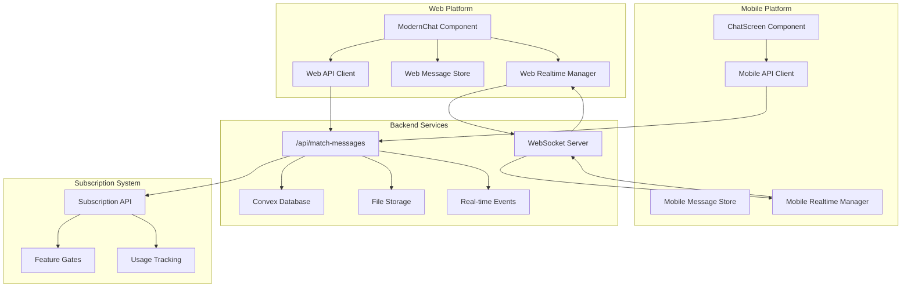
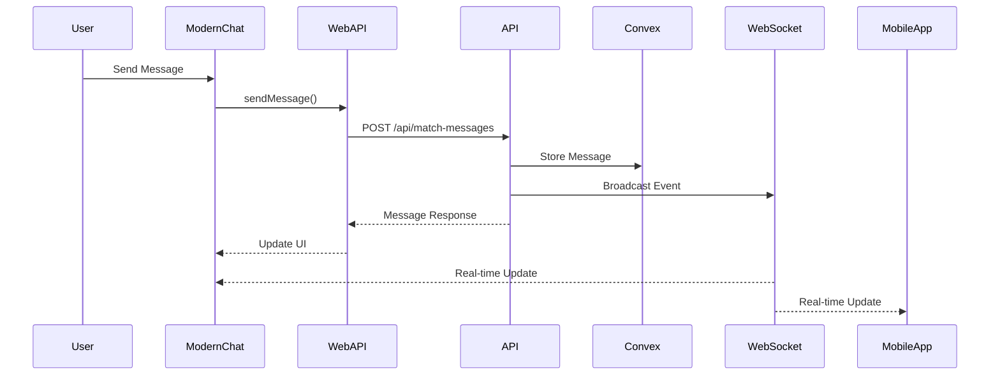

# Web Messaging System Alignment Design Document

## Overview

This design document outlines the comprehensive solution for aligning the web messaging system with the mobile platform and backend API. The design ensures consistent messaging functionality, proper subscription-based feature gating, real-time communication, and cross-platform synchronization between web and mobile applications.

## Architecture

### High-Level Architecture



### Web-Specific Message Flow



## Components and Interfaces

### 1. Web-Specific Message Interfaces

#### Enhanced Message Interface for Web
```typescript
export interface WebMessage extends Message {
  // Web-specific fields
  htmlContent?: string; // For rich text rendering
  webOptimized?: boolean;
  browserMetadata?: {
    userAgent: string;
    timestamp: number;
  };
}

export interface WebConversation extends Conversation {
  // Web-specific fields
  isActiveTab: boolean;
  notificationPermission: NotificationPermission;
  webNotificationId?: string;
}
```

### 2. Web API Client Implementation

#### Web-Aligned API Client
```typescript
export class WebMessagingAPI implements MessagingAPI {
  private baseUrl: string;
  private token: string;
  
  constructor(baseUrl: string, token: string) {
    this.baseUrl = baseUrl;
    this.token = token;
  }
  
  async getMessages(
    conversationId: string,
    options?: { limit?: number; before?: number }
  ): Promise<ApiResponse<Message[]>> {
    const params = new URLSearchParams({
      conversationId,
      ...(options?.limit && { limit: options.limit.toString() }),
      ...(options?.before && { before: options.before.toString() }),
    });
    
    const response = await fetch(`${this.baseUrl}/api/match-messages?${params}`, {
      headers: {
        'Authorization': `Bearer ${this.token}`,
        'Content-Type': 'application/json',
      },
    });
    
    return this.handleResponse(response);
  }
  
  async sendMessage(data: {
    conversationId: string;
    fromUserId: string;
    toUserId: string;
    text?: string;
    type?: "text" | "voice" | "image";
    audioStorageId?: string;
    duration?: number;
    fileSize?: number;
    mimeType?: string;
  }): Promise<ApiResponse<Message>> {
    const response = await fetch(`${this.baseUrl}/api/match-messages`, {
      method: 'POST',
      headers: {
        'Authorization': `Bearer ${this.token}`,
        'Content-Type': 'application/json',
      },
      body: JSON.stringify(data),
    });
    
    return this.handleResponse(response);
  }
  
  async markConversationAsRead(conversationId: string): Promise<ApiResponse<void>> {
    const response = await fetch(`${this.baseUrl}/api/messages/read`, {
      method: 'POST',
      headers: {
        'Authorization': `Bearer ${this.token}`,
        'Content-Type': 'application/json',
      },
      body: JSON.stringify({ conversationId }),
    });
    
    return this.handleResponse(response);
  }
  
  private async handleResponse<T>(response: Response): Promise<ApiResponse<T>> {
    if (!response.ok) {
      throw new Error(`API Error: ${response.status} ${response.statusText}`);
    }
    
    const data = await response.json();
    return { success: true, data };
  }
}
```

### 3. Web Real-time Messaging System

#### Web WebSocket Manager
```typescript
export class WebRealtimeMessaging {
  private ws: WebSocket | null = null;
  private eventBus: EventTarget;
  private reconnectAttempts = 0;
  private maxReconnectAttempts = 5;
  private reconnectDelay = 1000;
  
  constructor(private wsUrl: string, private token: string) {
    this.eventBus = new EventTarget();
  }
  
  connect(conversationId: string): void {
    try {
      this.ws = new WebSocket(`${this.wsUrl}?token=${this.token}&conversationId=${conversationId}`);
      
      this.ws.onopen = () => {
        console.log('WebSocket connected');
        this.reconnectAttempts = 0;
        this.dispatchEvent('connection:status', 'connected');
      };
      
      this.ws.onmessage = (event) => {
        const data = JSON.parse(event.data);
        this.handleMessage(data);
      };
      
      this.ws.onclose = () => {
        console.log('WebSocket disconnected');
        this.dispatchEvent('connection:status', 'disconnected');
        this.attemptReconnect(conversationId);
      };
      
      this.ws.onerror = (error) => {
        console.error('WebSocket error:', error);
      };
    } catch (error) {
      console.error('Failed to connect WebSocket:', error);
    }
  }
  
  private handleMessage(data: any): void {
    switch (data.type) {
      case 'message:new':
        this.dispatchEvent('message:new', data.message);
        break;
      case 'message:read':
        this.dispatchEvent('message:read', data);
        break;
      case 'typing:start':
        this.dispatchEvent('typing:start', data);
        break;
      case 'typing:stop':
        this.dispatchEvent('typing:stop', data);
        break;
    }
  }
  
  sendTypingIndicator(conversationId: string, action: "start" | "stop"): void {
    if (this.ws?.readyState === WebSocket.OPEN) {
      this.ws.send(JSON.stringify({
        type: 'typing',
        action,
        conversationId,
      }));
    }
  }
  
  private attemptReconnect(conversationId: string): void {
    if (this.reconnectAttempts < this.maxReconnectAttempts) {
      setTimeout(() => {
        this.reconnectAttempts++;
        this.connect(conversationId);
      }, this.reconnectDelay * Math.pow(2, this.reconnectAttempts));
    }
  }
  
  private dispatchEvent(type: string, data: any): void {
    this.eventBus.dispatchEvent(new CustomEvent(type, { detail: data }));
  }
  
  addEventListener(type: string, listener: EventListener): void {
    this.eventBus.addEventListener(type, listener);
  }
  
  removeEventListener(type: string, listener: EventListener): void {
    this.eventBus.removeEventListener(type, listener);
  }
  
  disconnect(): void {
    if (this.ws) {
      this.ws.close();
      this.ws = null;
    }
  }
}
```

### 4. Web Voice Message System

#### Web Voice Recording Implementation
```typescript
export class WebVoiceRecorder implements VoiceRecorder {
  private mediaRecorder: MediaRecorder | null = null;
  private audioChunks: Blob[] = [];
  private stream: MediaStream | null = null;
  private startTime: number = 0;
  
  public isRecording = false;
  public duration = 0;
  
  async startRecording(): Promise<void> {
    try {
      this.stream = await navigator.mediaDevices.getUserMedia({ 
        audio: {
          echoCancellation: true,
          noiseSuppression: true,
          autoGainControl: true,
        }
      });
      
      this.mediaRecorder = new MediaRecorder(this.stream, {
        mimeType: 'audio/webm;codecs=opus'
      });
      
      this.audioChunks = [];
      this.startTime = Date.now();
      
      this.mediaRecorder.ondataavailable = (event) => {
        if (event.data.size > 0) {
          this.audioChunks.push(event.data);
        }
      };
      
      this.mediaRecorder.start(100); // Collect data every 100ms
      this.isRecording = true;
      
      // Update duration timer
      const updateDuration = () => {
        if (this.isRecording) {
          this.duration = Math.floor((Date.now() - this.startTime) / 1000);
          setTimeout(updateDuration, 100);
        }
      };
      updateDuration();
      
    } catch (error) {
      throw new Error(`Failed to start recording: ${error.message}`);
    }
  }
  
  async stopRecording(): Promise<Blob> {
    return new Promise((resolve, reject) => {
      if (!this.mediaRecorder || !this.isRecording) {
        reject(new Error('Recording not started'));
        return;
      }
      
      this.mediaRecorder.onstop = () => {
        const audioBlob = new Blob(this.audioChunks, { type: 'audio/webm' });
        this.cleanup();
        resolve(audioBlob);
      };
      
      this.mediaRecorder.stop();
      this.isRecording = false;
    });
  }
  
  cancelRecording(): void {
    if (this.mediaRecorder && this.isRecording) {
      this.mediaRecorder.stop();
      this.isRecording = false;
      this.cleanup();
    }
  }
  
  private cleanup(): void {
    if (this.stream) {
      this.stream.getTracks().forEach(track => track.stop());
      this.stream = null;
    }
    this.mediaRecorder = null;
    this.audioChunks = [];
    this.duration = 0;
  }
}

export class WebVoicePlayer implements VoicePlayer {
  private audio: HTMLAudioElement | null = null;
  
  public isPlaying = false;
  public currentTime = 0;
  public duration = 0;
  
  async play(url: string): Promise<void> {
    try {
      if (this.audio) {
        this.stop();
      }
      
      this.audio = new Audio(url);
      
      this.audio.addEventListener('loadedmetadata', () => {
        this.duration = this.audio!.duration;
      });
      
      this.audio.addEventListener('timeupdate', () => {
        this.currentTime = this.audio!.currentTime;
      });
      
      this.audio.addEventListener('ended', () => {
        this.isPlaying = false;
        this.currentTime = 0;
      });
      
      await this.audio.play();
      this.isPlaying = true;
      
    } catch (error) {
      throw new Error(`Failed to play audio: ${error.message}`);
    }
  }
  
  pause(): void {
    if (this.audio && this.isPlaying) {
      this.audio.pause();
      this.isPlaying = false;
    }
  }
  
  stop(): void {
    if (this.audio) {
      this.audio.pause();
      this.audio.currentTime = 0;
      this.isPlaying = false;
      this.currentTime = 0;
    }
  }
  
  seek(position: number): void {
    if (this.audio) {
      this.audio.currentTime = position;
      this.currentTime = position;
    }
  }
}
```

### 5. Web Message Store Implementation

#### Zustand-based Message Store
```typescript
import { create } from 'zustand';
import { subscribeWithSelector } from 'zustand/middleware';

interface WebMessageStore {
  conversations: Record<string, WebConversation>;
  messages: Record<string, WebMessage[]>;
  typingUsers: Record<string, string[]>;
  connectionStatus: "connected" | "connecting" | "disconnected";
  activeConversationId: string | null;
  
  // Actions
  setActiveConversation: (conversationId: string | null) => void;
  addMessage: (message: WebMessage) => void;
  updateMessage: (messageId: string, updates: Partial<WebMessage>) => void;
  markAsRead: (conversationId: string, messageIds: string[]) => void;
  setTyping: (conversationId: string, userId: string, isTyping: boolean) => void;
  setConnectionStatus: (status: "connected" | "connecting" | "disconnected") => void;
  loadMessages: (conversationId: string, messages: WebMessage[]) => void;
  addOptimisticMessage: (message: Omit<WebMessage, "_id">) => string;
  confirmOptimisticMessage: (tempId: string, actualMessage: WebMessage) => void;
  rejectOptimisticMessage: (tempId: string, error: string) => void;
}

export const useWebMessageStore = create<WebMessageStore>()(
  subscribeWithSelector((set, get) => ({
    conversations: {},
    messages: {},
    typingUsers: {},
    connectionStatus: "disconnected",
    activeConversationId: null,
    
    setActiveConversation: (conversationId) => {
      set({ activeConversationId: conversationId });
    },
    
    addMessage: (message) => {
      set((state) => {
        const conversationMessages = state.messages[message.conversationId] || [];
        const updatedMessages = [...conversationMessages, message]
          .sort((a, b) => a.createdAt - b.createdAt);
        
        return {
          messages: {
            ...state.messages,
            [message.conversationId]: updatedMessages,
          },
        };
      });
    },
    
    updateMessage: (messageId, updates) => {
      set((state) => {
        const newMessages = { ...state.messages };
        
        Object.keys(newMessages).forEach(conversationId => {
          const messageIndex = newMessages[conversationId].findIndex(m => m._id === messageId);
          if (messageIndex !== -1) {
            newMessages[conversationId][messageIndex] = {
              ...newMessages[conversationId][messageIndex],
              ...updates,
            };
          }
        });
        
        return { messages: newMessages };
      });
    },
    
    markAsRead: (conversationId, messageIds) => {
      set((state) => {
        const conversationMessages = state.messages[conversationId] || [];
        const updatedMessages = conversationMessages.map(message => 
          messageIds.includes(message._id) 
            ? { ...message, readAt: Date.now() }
            : message
        );
        
        return {
          messages: {
            ...state.messages,
            [conversationId]: updatedMessages,
          },
        };
      });
    },
    
    setTyping: (conversationId, userId, isTyping) => {
      set((state) => {
        const currentTyping = state.typingUsers[conversationId] || [];
        const updatedTyping = isTyping
          ? [...currentTyping.filter(id => id !== userId), userId]
          : currentTyping.filter(id => id !== userId);
        
        return {
          typingUsers: {
            ...state.typingUsers,
            [conversationId]: updatedTyping,
          },
        };
      });
    },
    
    setConnectionStatus: (status) => {
      set({ connectionStatus: status });
    },
    
    loadMessages: (conversationId, messages) => {
      set((state) => ({
        messages: {
          ...state.messages,
          [conversationId]: messages.sort((a, b) => a.createdAt - b.createdAt),
        },
      }));
    },
    
    addOptimisticMessage: (message) => {
      const tempId = `temp-${Date.now()}-${Math.random()}`;
      const optimisticMessage: WebMessage = {
        ...message,
        _id: tempId,
        status: "pending",
        isOptimistic: true,
      };
      
      get().addMessage(optimisticMessage);
      return tempId;
    },
    
    confirmOptimisticMessage: (tempId, actualMessage) => {
      set((state) => {
        const newMessages = { ...state.messages };
        
        Object.keys(newMessages).forEach(conversationId => {
          const messageIndex = newMessages[conversationId].findIndex(m => m._id === tempId);
          if (messageIndex !== -1) {
            newMessages[conversationId][messageIndex] = actualMessage;
          }
        });
        
        return { messages: newMessages };
      });
    },
    
    rejectOptimisticMessage: (tempId, error) => {
      get().updateMessage(tempId, { status: "failed", error });
    },
  }))
);
```

## ModernChat Component Enhancement

### Enhanced ModernChat Implementation
```typescript
import React, { useEffect, useRef, useState } from 'react';
import { useWebMessageStore } from './stores/webMessageStore';
import { WebMessagingAPI } from './api/webMessagingAPI';
import { WebRealtimeMessaging } from './realtime/webRealtimeMessaging';
import { WebVoiceRecorder, WebVoicePlayer } from './voice/webVoiceSystem';

interface ModernChatProps {
  conversationId: string;
  currentUserId: string;
  partnerId: string;
  subscriptionTier: SubscriptionTier;
}

export const ModernChat: React.FC<ModernChatProps> = ({
  conversationId,
  currentUserId,
  partnerId,
  subscriptionTier,
}) => {
  const {
    messages,
    typingUsers,
    connectionStatus,
    addMessage,
    setTyping,
    setConnectionStatus,
    addOptimisticMessage,
    confirmOptimisticMessage,
    rejectOptimisticMessage,
  } = useWebMessageStore();
  
  const [api] = useState(() => new WebMessagingAPI('/api', 'user-token'));
  const [realtime] = useState(() => new WebRealtimeMessaging('ws://localhost:3001', 'user-token'));
  const [voiceRecorder] = useState(() => new WebVoiceRecorder());
  const [voicePlayer] = useState(() => new WebVoicePlayer());
  
  const [inputText, setInputText] = useState('');
  const [isRecording, setIsRecording] = useState(false);
  const messagesEndRef = useRef<HTMLDivElement>(null);
  
  const conversationMessages = messages[conversationId] || [];
  const messagingFeatures = getMessagingFeatures(subscriptionTier);
  
  useEffect(() => {
    // Connect to real-time messaging
    realtime.connect(conversationId);
    
    // Set up event listeners
    realtime.addEventListener('message:new', (event: CustomEvent) => {
      addMessage(event.detail);
    });
    
    realtime.addEventListener('typing:start', (event: CustomEvent) => {
      setTyping(conversationId, event.detail.userId, true);
    });
    
    realtime.addEventListener('typing:stop', (event: CustomEvent) => {
      setTyping(conversationId, event.detail.userId, false);
    });
    
    realtime.addEventListener('connection:status', (event: CustomEvent) => {
      setConnectionStatus(event.detail);
    });
    
    return () => {
      realtime.disconnect();
    };
  }, [conversationId]);
  
  useEffect(() => {
    // Auto-scroll to bottom when new messages arrive
    messagesEndRef.current?.scrollIntoView({ behavior: 'smooth' });
  }, [conversationMessages]);
  
  const handleSendMessage = async () => {
    if (!inputText.trim()) return;
    
    if (!messagingFeatures.canSendUnlimitedMessages) {
      // Check daily limit for free users
      // Implementation would check against usage tracking
    }
    
    const tempId = addOptimisticMessage({
      conversationId,
      fromUserId: currentUserId,
      toUserId: partnerId,
      text: inputText,
      type: "text",
      createdAt: Date.now(),
    });
    
    setInputText('');
    
    try {
      const response = await api.sendMessage({
        conversationId,
        fromUserId: currentUserId,
        toUserId: partnerId,
        text: inputText,
        type: "text",
      });
      
      confirmOptimisticMessage(tempId, response.data);
    } catch (error) {
      rejectOptimisticMessage(tempId, error.message);
    }
  };
  
  const handleStartVoiceRecording = async () => {
    if (!messagingFeatures.canSendVoiceMessages) {
      // Show upgrade prompt
      return;
    }
    
    try {
      await voiceRecorder.startRecording();
      setIsRecording(true);
    } catch (error) {
      console.error('Failed to start recording:', error);
    }
  };
  
  const handleStopVoiceRecording = async () => {
    try {
      const audioBlob = await voiceRecorder.stopRecording();
      setIsRecording(false);
      
      // Upload and send voice message
      const voiceManager = new VoiceMessageManager(api);
      await voiceManager.uploadVoiceMessage(
        audioBlob,
        conversationId,
        currentUserId,
        partnerId,
        voiceRecorder.duration
      );
    } catch (error) {
      console.error('Failed to send voice message:', error);
      setIsRecording(false);
    }
  };
  
  const renderMessage = (message: WebMessage) => {
    switch (message.type) {
      case "text":
        return (
          <div className="message text-message">
            <p>{message.text}</p>
            {message.status && (
              <span className={`status ${message.status}`}>
                {message.status}
              </span>
            )}
          </div>
        );
      
      case "voice":
        return (
          <div className="message voice-message">
            <button 
              onClick={() => voicePlayer.play(message.audioUrl)}
              className="play-button"
            >
              {voicePlayer.isPlaying ? '⏸️' : '▶️'}
            </button>
            <span className="duration">{message.duration}s</span>
          </div>
        );
      
      default:
        return <div className="message unknown-type">Unsupported message type</div>;
    }
  };
  
  return (
    <div className="modern-chat">
      <div className="connection-status">
        Status: {connectionStatus}
      </div>
      
      <div className="messages-container">
        {conversationMessages.map((message) => (
          <div key={message._id} className={`message-wrapper ${message.fromUserId === currentUserId ? 'sent' : 'received'}`}>
            {renderMessage(message)}
          </div>
        ))}
        
        {typingUsers[conversationId]?.length > 0 && (
          <div className="typing-indicator">
            Someone is typing...
          </div>
        )}
        
        <div ref={messagesEndRef} />
      </div>
      
      <div className="input-container">
        <input
          type="text"
          value={inputText}
          onChange={(e) => setInputText(e.target.value)}
          onKeyPress={(e) => e.key === 'Enter' && handleSendMessage()}
          placeholder="Type a message..."
          disabled={isRecording}
        />
        
        <button onClick={handleSendMessage} disabled={!inputText.trim() || isRecording}>
          Send
        </button>
        
        {messagingFeatures.canSendVoiceMessages && (
          <button
            onMouseDown={handleStartVoiceRecording}
            onMouseUp={handleStopVoiceRecording}
            className={`voice-button ${isRecording ? 'recording' : ''}`}
          >
            🎤
          </button>
        )}
      </div>
    </div>
  );
};
```

## Performance Optimizations

### 1. Message Virtualization
```typescript
import { FixedSizeList as List } from 'react-window';

const VirtualizedMessageList: React.FC<{
  messages: WebMessage[];
  height: number;
}> = ({ messages, height }) => {
  const Row = ({ index, style }: { index: number; style: React.CSSProperties }) => (
    <div style={style}>
      {renderMessage(messages[index])}
    </div>
  );
  
  return (
    <List
      height={height}
      itemCount={messages.length}
      itemSize={80}
      width="100%"
    >
      {Row}
    </List>
  );
};
```

### 2. Web-Specific Caching
```typescript
export class WebMessageCache {
  private cache = new Map<string, WebMessage[]>();
  private indexedDB: IDBDatabase | null = null;
  
  async initialize(): Promise<void> {
    return new Promise((resolve, reject) => {
      const request = indexedDB.open('MessagingCache', 1);
      
      request.onerror = () => reject(request.error);
      request.onsuccess = () => {
        this.indexedDB = request.result;
        resolve();
      };
      
      request.onupgradeneeded = () => {
        const db = request.result;
        if (!db.objectStoreNames.contains('messages')) {
          db.createObjectStore('messages', { keyPath: 'conversationId' });
        }
      };
    });
  }
  
  async persistMessages(conversationId: string, messages: WebMessage[]): Promise<void> {
    if (!this.indexedDB) return;
    
    const transaction = this.indexedDB.transaction(['messages'], 'readwrite');
    const store = transaction.objectStore('messages');
    
    await store.put({ conversationId, messages, timestamp: Date.now() });
  }
  
  async loadPersistedMessages(conversationId: string): Promise<WebMessage[] | null> {
    if (!this.indexedDB) return null;
    
    return new Promise((resolve) => {
      const transaction = this.indexedDB!.transaction(['messages'], 'readonly');
      const store = transaction.objectStore('messages');
      const request = store.get(conversationId);
      
      request.onsuccess = () => {
        const result = request.result;
        if (result && Date.now() - result.timestamp < 24 * 60 * 60 * 1000) { // 24 hours
          resolve(result.messages);
        } else {
          resolve(null);
        }
      };
      
      request.onerror = () => resolve(null);
    });
  }
}
```

## Security and Privacy

### 1. Web-Specific Security Measures
```typescript
export class WebSecurityManager {
  static sanitizeMessage(text: string): string {
    // Remove potentially harmful content
    return text
      .replace(/<script\b[^<]*(?:(?!<\/script>)<[^<]*)*<\/script>/gi, '')
      .replace(/<iframe\b[^<]*(?:(?!<\/iframe>)<[^<]*)*<\/iframe>/gi, '')
      .replace(/javascript:/gi, '')
      .replace(/on\w+\s*=/gi, '')
      .trim();
  }
  
  static validateFileUpload(file: File): { valid: boolean; error?: string } {
    const allowedTypes = ['audio/webm', 'audio/mp4', 'audio/mpeg'];
    const maxSize = 10 * 1024 * 1024; // 10MB
    
    if (!allowedTypes.includes(file.type)) {
      return { valid: false, error: 'Invalid file type' };
    }
    
    if (file.size > maxSize) {
      return { valid: false, error: 'File too large' };
    }
    
    return { valid: true };
  }
  
  static generateCSRFToken(): string {
    return crypto.randomUUID();
  }
}
```

## Testing Strategy

### 1. Web-Specific Testing
```typescript
describe('Web Messaging System', () => {
  describe('ModernChat Component', () => {
    it('should render messages correctly');
    it('should handle real-time updates');
    it('should support voice message recording');
    it('should respect subscription limits');
  });
  
  describe('Web API Client', () => {
    it('should align with mobile API calls');
    it('should handle network errors gracefully');
    it('should implement proper retry logic');
  });
  
  describe('Real-time Features', () => {
    it('should connect to WebSocket correctly');
    it('should handle typing indicators');
    it('should sync with mobile platform');
  });
});
```

This design ensures that the web messaging system is fully aligned with the mobile platform while leveraging web-specific capabilities and maintaining optimal performance and security standards.