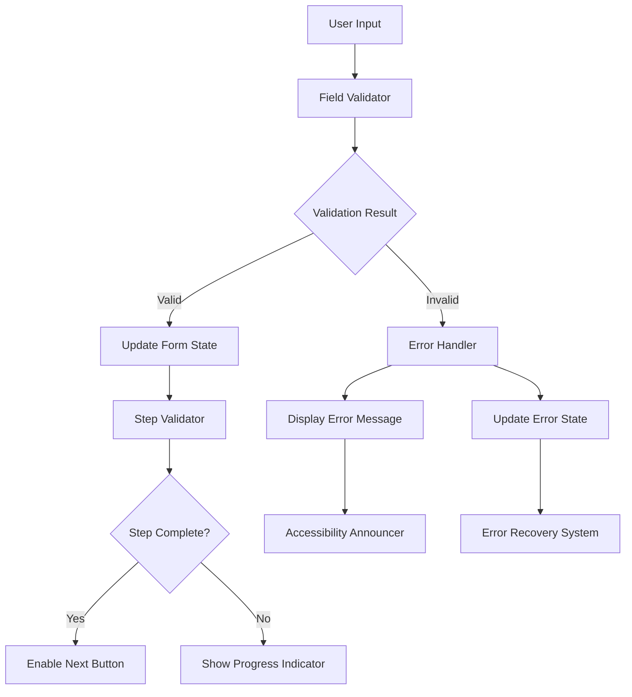

# Profile Creation Validation Enhancement Design

## Overview

This design document outlines the technical approach for enhancing validation and error handling in the profile creation modal. The solution focuses on creating a robust, user-friendly validation system that provides clear feedback and prevents user frustration.

## Architecture

### Validation System Architecture



### Component Structure

```
ProfileCreationModal/
├── ValidationProvider/
│   ├── FieldValidator
│   ├── StepValidator
│   ├── ErrorHandler
│   └── ProgressTracker
├── FormSteps/
│   ├── BasicInfoStep
│   ├── LocationStep
│   ├── CulturalStep
│   ├── EducationStep
│   ├── PreferencesStep
│   └── PhotosStep
└── UI Components/
    ├── ValidatedInput
    ├── ErrorMessage
    ├── ProgressIndicator
    └── SuccessIndicator
```

## Components and Interfaces

### 1. Enhanced Validation Schema

```typescript
// Enhanced validation with better error messages and field-specific rules
const enhancedValidationSchemas = {
  // Step 1: Basic Info
  basicInfo: z.object({
    profileFor: z.enum(['self', 'friend', 'family'], {
      errorMap: () => ({ message: 'Please select who this profile is for' })
    }),
    gender: z.enum(['male', 'female', 'other'], {
      errorMap: () => ({ message: 'Please select your gender' })
    }),
    fullName: z.string()
      .min(2, 'Name must be at least 2 characters')
      .max(50, 'Name cannot exceed 50 characters')
      .regex(/^[a-zA-Z\s]+$/, 'Name can only contain letters and spaces'),
    dateOfBirth: z.string()
      .min(1, 'Date of birth is required')
      .refine(validateAge, 'You must be at least 18 years old'),
    phoneNumber: z.string()
      .min(10, 'Phone number must be at least 10 digits')
      .regex(/^\+?[\d\s\-\(\)]+$/, 'Please enter a valid phone number')
  }),
  
  // Step 2: Location & Physical
  location: z.object({
    country: z.string().optional(),
    city: z.string()
      .min(1, 'City is required')
      .max(50, 'City name is too long'),
    height: z.string()
      .min(1, 'Height is required')
      .refine(validateHeight, 'Please enter a valid height'),
    maritalStatus: z.enum(['single', 'divorced', 'widowed', 'annulled'], {
      errorMap: () => ({ message: 'Please select your marital status' })
    }),
    physicalStatus: z.string().optional()
  }),
  
  // Additional steps...
};
```

### 2. Field Validator Component

```typescript
interface FieldValidatorProps {
  field: keyof ProfileCreationData;
  value: unknown;
  schema: z.ZodSchema;
  onValidation: (field: string, isValid: boolean, error?: string) => void;
  debounceMs?: number;
}

const FieldValidator: React.FC<FieldValidatorProps> = ({
  field,
  value,
  schema,
  onValidation,
  debounceMs = 500
}) => {
  // Debounced validation logic
  // Real-time feedback
  // Error state management
};
```

### 3. Enhanced Error Handler

```typescript
interface ErrorState {
  fieldErrors: Record<string, string>;
  stepErrors: Record<number, string[]>;
  globalErrors: string[];
  networkErrors: string[];
}

class ValidationErrorHandler {
  private errorState: ErrorState;
  
  handleFieldError(field: string, error: string): void;
  handleStepError(step: number, errors: string[]): void;
  handleNetworkError(error: NetworkError): void;
  clearErrors(scope: 'field' | 'step' | 'global'): void;
  getErrorSummary(): string[];
  announceError(error: string): void; // For accessibility
}
```

### 4. Progress Tracker

```typescript
interface StepProgress {
  stepNumber: number;
  isComplete: boolean;
  requiredFields: string[];
  completedFields: string[];
  errors: string[];
}

interface ProgressState {
  currentStep: number;
  steps: StepProgress[];
  overallProgress: number;
  canProceed: boolean;
}
```

## Data Models

### Enhanced Form State

```typescript
interface EnhancedFormState {
  data: ProfileCreationData;
  validation: {
    fieldErrors: Record<string, string>;
    stepValidation: Record<number, boolean>;
    isSubmitting: boolean;
    hasUnsavedChanges: boolean;
  };
  progress: {
    currentStep: number;
    completedSteps: number[];
    requiredFieldsComplete: boolean;
  };
  ui: {
    showErrors: boolean;
    focusedField: string | null;
    lastValidatedStep: number;
  };
}
```

### Validation Rules Configuration

```typescript
interface ValidationRule {
  field: string;
  type: 'required' | 'format' | 'length' | 'custom';
  message: string;
  validator?: (value: unknown) => boolean;
  hint?: string;
  example?: string;
}

interface StepValidationConfig {
  stepNumber: number;
  title: string;
  rules: ValidationRule[];
  dependencies?: string[]; // Fields that affect this step
}
```

## Error Handling

### Error Types and Recovery

```typescript
enum ValidationErrorType {
  FIELD_REQUIRED = 'field_required',
  FIELD_FORMAT = 'field_format',
  FIELD_LENGTH = 'field_length',
  STEP_INCOMPLETE = 'step_incomplete',
  NETWORK_ERROR = 'network_error',
  SERVER_ERROR = 'server_error',
  AUTH_ERROR = 'auth_error'
}

interface ErrorRecoveryStrategy {
  errorType: ValidationErrorType;
  retryable: boolean;
  recoveryAction: () => Promise<void>;
  userMessage: string;
  technicalMessage?: string;
}
```

### Error Message Templates

```typescript
const errorMessages = {
  required: (fieldName: string) => `${fieldName} is required`,
  minLength: (fieldName: string, min: number) => 
    `${fieldName} must be at least ${min} characters`,
  maxLength: (fieldName: string, max: number) => 
    `${fieldName} cannot exceed ${max} characters`,
  format: (fieldName: string, format: string) => 
    `${fieldName} must be in ${format} format`,
  custom: (fieldName: string, message: string) => 
    `${fieldName}: ${message}`,
  network: () => 'Connection error. Please check your internet and try again.',
  server: () => 'Server error. Please try again in a few moments.',
  auth: () => 'Authentication expired. Please sign in again.'
};
```

## Testing Strategy

### Unit Tests

1. **Field Validation Tests**
   - Test each validation rule individually
   - Test edge cases and boundary conditions
   - Test error message generation

2. **Step Validation Tests**
   - Test step completion logic
   - Test navigation prevention with invalid data
   - Test progress tracking accuracy

3. **Error Handling Tests**
   - Test error state management
   - Test error recovery mechanisms
   - Test accessibility announcements

### Integration Tests

1. **Form Flow Tests**
   - Test complete form submission with valid data
   - Test form submission with various error scenarios
   - Test data persistence across page refreshes

2. **User Experience Tests**
   - Test keyboard navigation with errors
   - Test screen reader compatibility
   - Test mobile responsiveness with error states

### End-to-End Tests

1. **Complete Profile Creation**
   - Test successful profile creation flow
   - Test error recovery scenarios
   - Test data persistence and restoration

2. **Error Scenarios**
   - Test network failure recovery
   - Test server error handling
   - Test authentication error recovery

## Implementation Phases

### Phase 1: Enhanced Field Validation
- Implement debounced field validation
- Add comprehensive validation schemas
- Create reusable ValidatedInput component

### Phase 2: Step-by-Step Validation
- Implement step validation logic
- Add progress tracking
- Create error summary component

### Phase 3: Error Recovery System
- Implement error state management
- Add network error recovery
- Create data persistence layer

### Phase 4: Accessibility and Polish
- Add screen reader support
- Implement keyboard navigation
- Add visual error indicators

### Phase 5: Testing and Optimization
- Comprehensive testing suite
- Performance optimization
- User experience refinements